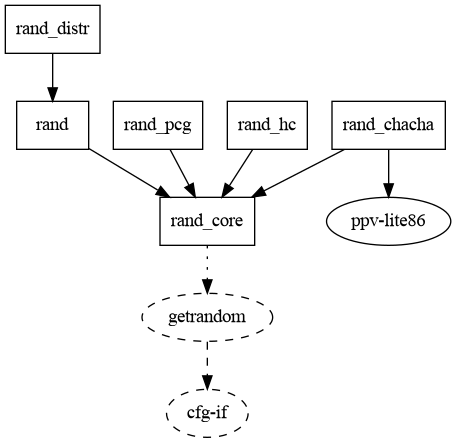

+++
title = "Something something cargo-depgraph"
date = 2020-07-12
draft = true
+++

`cargo-depgraph` is a cargo plugin that generates [DOT][] code for cargo-enabled
Rust projects' dependency graphs. This code is usually fed directly to `dot`,
which then generates a png, svg or whatever else you want from it.

[DOT]: https://en.wikipedia.org/wiki/DOT_(graph_description_language)

> Before you ask: As with most cargo plugins, installation is just
> `cargo install cargo-depgraph` 😉

If you're a redditor and frequenting [/r/rust][], you might have seen my
announcemment of cargo-depgraph two weeks ago. Since the initial announcement,
I have extended it quite a bit, and I now consider it the go-to tool when you
want to have a closer look at your dependency graph.

## Enough with the talking!

Let's start with a small dependency graph, `rand`s:

<figure>

</figure>

> All the graphs in this article are generated using
> `cargo depgraph [options] | dot -Tpng > some-file.png`. This first one used no
> options at all, all others will have a caption below that lists the options
> that were used.

[/r/rust]: https://reddit.com/r/rust
